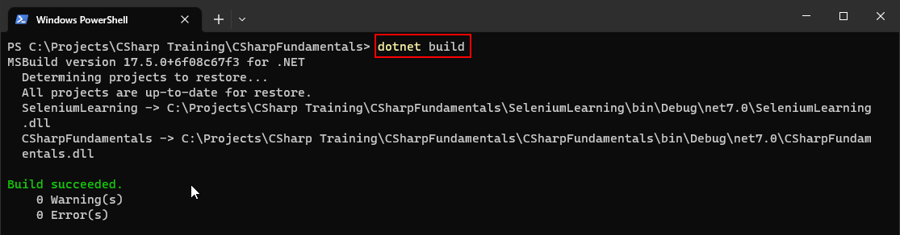

# CSharp Training with Selenium
### Created this repository as part of training for the CSharp Programming With Selenium.


## To Build the Project from the Command Line

```bash
dotnet build
```




## To Run the Tests from the Command Line
```bash
dotnet test "C:\Projects\CSharp Training\CSharpFundamentals\SeleniumLearning\bin\Debug\net7.0\SeleniumLearning.dll"
```


## To Run the Tests from the Command Line and Print the Results at the End.
```bash
dotnet test "C:\Projects\CSharp Training\CSharpFundamentals\SeleniumLearning\bin\Debug\net7.0\SeleniumLearning.dll" -v:normal
```
